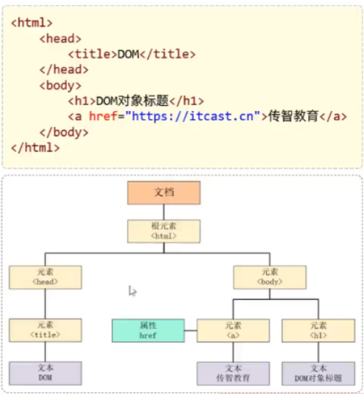
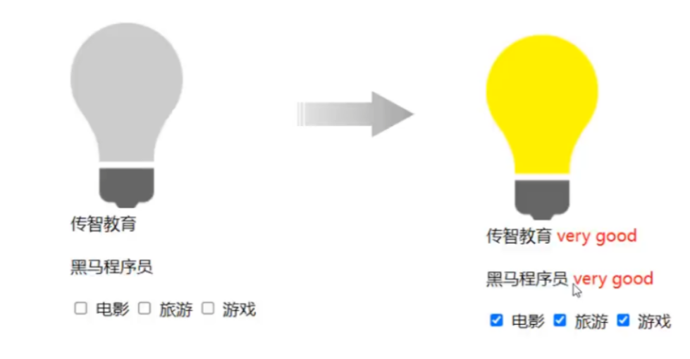
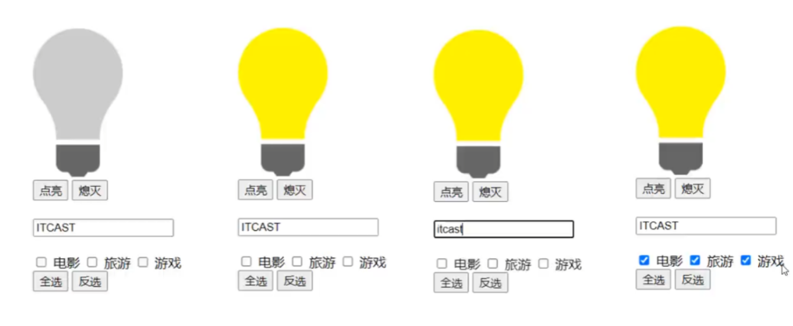

JavaScript(简称:JS)是一门跨平台、面向对象的**脚本语言**(直接解释执行, 不需要编译)。是用来控制网页行为的，它能使网页可交互。ECMAScript 6(**ES6**)是最新的JavaScript版本(发布于2015年)。

## js引入方式
1. 内部脚本: 也即在html页面内部嵌入 -- 使用`<script>`标签
   * lavaScript代码必须位于`<script></script>`标签之间
   * 在HTML文档中，可以在任意地方，放置任意数量的`<script>`
   * 一般会把脚本置于`<body>`元素的底部，可改善显示速度
```js
<script>
    window.alert("Hello JavaScript")
</script>
```
1. 外部脚本: 将JS代码定义在外部JS文件中，然后引入到 HTML页面中
   * 外部JS文件中，只包含JS代码，不包含`<script>`标签
   * `<script>`标签不能自闭合
```js
<script src="js/demo.js"></script>
```
## js基础语法
### 基础语法
* 区分大小写:与Java 一样，变量名、函数名以及其他一切东西都是区分大小写的
* 每行结尾的分号可有可无
* 注释:
   * 单行注释: `//注释内容`
   * 多行注释: `/*注释内容*/`
* 输出语句
  * 使用 `window.alert()` 写入警告框
  * 使用 `document.write()` 写入 HTML 输出
  * 使用 `console.log()` 写入浏览器控制台
### 变量与函数
JavaScript 中用 `var` 关键字 (variable 的缩写)来声明变量. JavaScript是一门弱类型语言，变量可以存放不同类型的值

变量名需要遵循如下规则:
* 组成字符可以是任何字母、数字、下划线()或美元符号 ($)
* 数字不能开头
* 建议使用驼峰命名

**注意: var 定义的变量是全局变量, 可重复定义**
ECMAScriot 6 新增了 `let` 关键字来定义变量。它的用法类似于 var，但是所声明的变量，**只在 let 关键字所在的代码块内有效，且不允许重复声明**
ECMAScript6 新增了 `const` 关键字，用来声明一个只读的常量。一旦声明，常量的值就不能改变

#### 变量类型
lavaScript中分为:原始类型和引用类型
var a = 20:
a ="张三";

* **原始类型**

类型 | 说明
|:-|:-|
|number| 数字(整数、小数、NaN(Not a Number))|
string|字符串，单双引皆可
boolean|布尔。true，false
null|对象为空
undefined|当声明的变量未初始化时，该变量的默认值是 undefined

#### 运算符
| 运算类型| 运算符号
|:-:|:-|
|算术运算符|+ - * / % ++ --|
|赋值运算符|= += -= *= /= %=|
|比较运算符|> < >= <= != == |
|逻辑运算符|&& ! \|\||
|三元运算符| 条件表达式?true value:false value|
#### 类型转换
1. string -> number: 如果字面值不是数字，则转为NaN;
2. 其他类型转为boolean:
   Number: 0和NaN为false, 其他均转为true。
   String: 空字符串为false，其他均转为true。
   Null和undefined: 均转为false。
#### 函数function
介绍:函数(方法)是被设计为执行特定任务的代码块。
定义:JavaScript 函数通过 function 关键字进行定义，语法为:
```js
function functionName(参数1, 参数2..){
   //要执行的代码
}
```
注意:
形式参数不需要类型。因为JavaScript是弱类型语言
返回值也不需要定义类型，可以在函数内部直接使用return返回即可调用:数名称(实际参数列表)

或者采取这样的语法:
```js
var add = function(a , b){
   return a + b;
}
var result = add(10,20);
alert(result);
```

## js对象
### Array
定义方法: 
`var arr = [1,2,3,4];`
特点: 长度可变 类型可变
`arr[10] = 50;`
`arr[2] = "hello";`

属性: length, 设置或返回数组中元素的数量。
方法|描述
:-|:-
forEach()|遍历数组中的每个有值的元素，并调用一次传入的函数
push()|将新元素添加到数组的末尾，并返回新的长度
splice()|从数组中删除元素

注意, forEach 具有一种简化形式:
```js
// forEach: 遍历数组中有值的元素
arr.forEach(function(e){
   console.log(e);
});
// ES6 箭头函数: (...) => {...}简化函数定义
arr.forEach((e) =>{
   console.log(e);
});
```
### String
定义方法:
```js
var str = "Hello String"; // 也可使用单引号`
```
字段 | 描述
:-|:-
length | 属性, 字符串的长度。
charAt()|返回在指定位置的字符
indexof()|检索字符串
trim()|去除字符串两边的空格
substring()|提取字符串中两个指定的索引号之间的字符
### 自定义对象
一般格式:
```js
var 对象名 = {
   属性名1: 属性值1,
   属性名2: 属性值2,
   属性名3: 属性值3,
   函数名称: function(形参列表){}
}
```
用法示例:
```js
var user = {
   "name": "Jasonic",
   "age": 28,
   "gender": "female",
   "eat": function(){
      console.log("eat something.")
   }
}
```
访问方法:
对象名.属性名;
对象名.函数名();
### JSON
json 对象多用于网络数据的传输, 它是从自定义对象扩展来的
* JSON-语法定义
  `var 变量名 = '{"key1": value1，"key2": value2}';`
* value的数据类型为:
  * 数字(整数或浮点数)
  * 字符串(在双引号中)
  * 逻辑值 (true 或false)
  * 数组(在方括号中)
* json 字符串示例:
  `var userStr = '{"addr":["北京","上海","西安"], "name":"Jerry", "age":18}'`
* JSON字符串转为JSON对象: `var jsObject = JSON.parse(userstr);`
* JS对象转为ISON字符串: `var jsonStr = JSON.stringify(jsobject);`

### BOM
**BOM:Browser Object Model 浏览器对象模型**，允许avacript与浏览器对话，JavaScript 将浏览器的各个组成部分封装为对象:
* `Window`:浏览器窗口对象
* `Navigator`:浏览器对象
* `Screen`:屏幕对象
* `History`:历史记录对象
* `Location`:地址栏对象
* ...

其中比较重要的是 `Window` 对象:
属性
history: 对 History 对象的只读引用。
location: 用于窗口或框架的 Location 对象。
navigator: 对Navigator 对象的只读引用。
方法
`alert`(): 显示带有一段消息和一个确认按钮的警告框
`confirm`():显示带有一段消息以及确认按钮和取消按钮的对话框
`setlnterval`(): 按照指定的周期 (以毫秒计)来调用函数或计算表达式
`setTimeout`(): 在指定的毫秒数后调用函数或计算表达式

`window.location.href`:c设置或返回完整的URL。
`location.href = "https://www.github.com";`

```js
var id = 10010;
function f1() {
   ++id;
   console.log(id);
};
setInterval(f1, 1500);  // 注意这里是以 ms 为单位, 每隔 1.5s 就执行一次 f1()
var flg = confirm("是不是要吃饭了?")   // 弹出确认框, 选择确认则返回一个 true
if(flg){
   setTimeout(function f(){
      window.location.href = "https://www.github.com";
   }, 2000) // 表示过 2s 就跳转到 github 网站
}
```


### DOM
概念: Document Obiect Model，文档对象模型
将标记语言的各个组成部分封装为对应的对象:
```git
Document:整个文档对象
Element:元素对象
Attribute: 届性对象
Text:文本对象
Comment:注释对象
```


JavaScript 通过DOM，就能够对HTML进行操作
1. 改变HTML元素的内容
2. 改变HTML元素的样式(CSS)
3. 对HTMLDOM 事件作出反应
4. 添加和删除 HTML元素

HTML中的Element对象可以通过Document对象获取，而Document对象是通过window对象获取的, Document对象中提供了以下获取Element元素对象的函数:
1. 根据id属性值获取，返回单个Element对象: `var h1 = document.getElementById( h1');`
2. 根据标签名称获取，返回**Element对象数组**: `var divs = document.getElementsByTagName( 'div');`
3. 根据name属性值获取，返回Element对象数组: `var hobbys = document.getElementsByName( hobby');`
4. 根据class属性值获取，返回Element对象数组: `var clss = document.getElementsByClassName('cls');`

> 通过DOM操作，完成如下效果实现:
> 点亮灯泡
> 将所有的div标签的标签体内容后面加上: very good
> 使所有的复选框呈现被选中的状态
> 
> 1.点亮灯泡 : src 属性值
> 2 .将所有div标签的内容后面加上: very good (红色字体) -- `<font color='red'></font>`


## js事件监听

事件: HTML事件是发生在HTML元素上的“事情”。比如:
* 按钮被点击
* 鼠标移动到元素上
* 按下键盘按键

事件监听: JavaScript可以**在事件被侦测到时执行代码**

### 事件绑定
1. 通过HTML标签中的事件属性进行绑定
```js
<input type="button" onclick="on()" value="按钮1">
<script>
function on(){
   alert("我被点击了!);
}
</script>
```

2. 方式二:通过DOM元素属性绑定
```js
<input type="button" id="btn" value="按钮2">
<script>
   document.getElementById('btn').onclick=function(){
      alert("我被点击了!);
   }
</script>

```
### 常见事件
事件名|说明
:-:|:-
onclick|鼠标单击事件
onblur|元素失去焦点
onfocus|元素获得焦点
onload|某个页面或图像被完成加载
onsubmit|当表单提交时触发该事件
onkeydown|某个键盘的键被按下
onmouseover|鼠标被移到某元素之上
onmouseout|鼠标从某元素移开

> 通过事件监听及DOM操作，完成如下效果实现
> 1. 点击【点亮】按钮点亮灯泡，点击【熄灭】按钮 熄灭灯泡
> 2. 输入框鼠标聚焦后， 展示小写; 鼠标离焦后, 展示大写
> 3. 点击【全选】按钮使所有的复选框呈现被选中的状态, 点击【反选】按钮使所有的复选框呈现取消勾选的状态
> 

提示: checkbox 写法
```html
<input type="checkbox" name="sport">篮球
<input type="checkbox" name="sport">网球
<input type="checkbox" name="sport">足球
<input type="checkbox" name="sport">排球
<input type="checkbox" name="sport">冰壶
```
