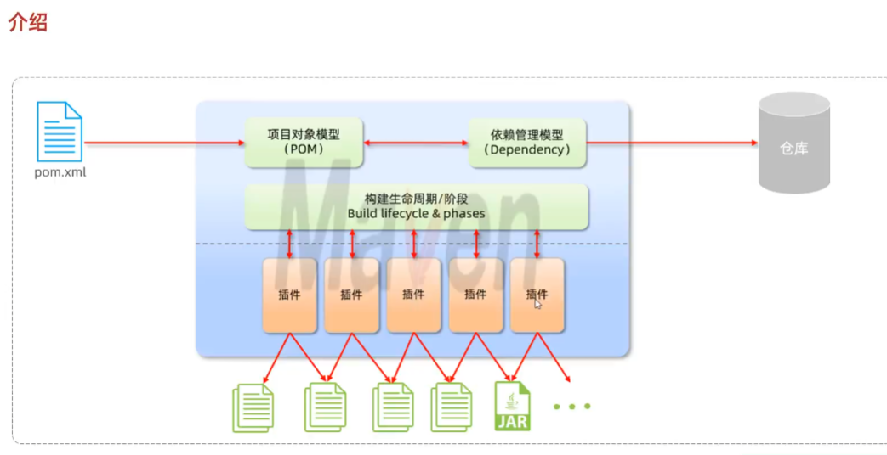

## Maven是什么?
Maven 是 Apache部门开发的一个开源的 Java项目管理和构建工具, 它基于项目对象模型(POM)的概念, 通过一小段描述信息来管理项目的构建。

## Maven 的作用
1. 依赖管理
方便快捷的管理项目依赖的资源(jar包)，避免版本冲突问题
2. 统一项目结构
提供标准、统一的项目结构
3. 项目构建
标准跨平台 (Linux、WindowsMacos) 的自动化项目构建方式
http://maven.apache.org/

## Maven 工作基本原理

仓库:用于存储资源，管理各种jar包。

## IDEA 中集成 Maven
1. 官网下载Maven至本地并添加环境变量
2. 配置本地仓库存放位置，添加阿里云镜像
3. 可以使用命令行创建maven项目
4. 或者使用idea创建maven项目（推荐）
5. 运行时注意将settings 中的 build-maven下的home-dir user-setting-file 以及local-Repository 配置好路径
6. 把maven 下的runner和import均设置为jdk1.8
参考链接：https://blog.csdn.net/qq_40187702/article/details/130660992

https://blog.csdn.net/qq_42057154/article/details/106114515

## 常用MAVEN命令
maven命令|描述
:-|:-|
mvn -v |//查看版本
mvn compile| //编译源代码
mvn test-compile| //编译测试代码
mvn test |//运行应用程序中的单元测试
mvn site |//生成项目相关信息的网站
mvn package| //依据项目生成 jar 文件
mvn install |//在本地 Repository 中安装 jar
mvn -Dmaven.test.skip=true| //忽略测试文档编译
mvn clean |//清除目标目录中的生成结果
mvn clean compile| //将 .java类编译为.class文件
mvn clean package |//进行打包
mvn clean test |//执行单元测试
mvn clean deploy| //部署到版本仓库
mvn clean install| //使其他项目使用这个jar,会安装到maven本地仓库中
mvn archetype:generate| //创建项目
mvn dependency:list |//查看已解析依赖
mvn dependency:tree |//看到依赖树
mvn dependency:analyze| //查看依赖的工具
mvn help:system |//从中央仓库下载文件至本地仓库
mvn help:active-profiles| //查看当前激活的profiles
mvn help:all-profiles |//查看所有profiles
mvn help:effective -pom| //查看完整的pom信息

### maven log info
[INFO] ----------------------------------------------------------------------------
[INFO] Using following parameters for creating project from Archetype: maven-archetype-quickstart:1.4
[INFO] ----------------------------------------------------------------------------
[INFO] Parameter: groupId, Value: cn.zju.bciprj
[INFO] Parameter: artifactId, Value: hello
[INFO] Parameter: version, Value: 1.0-SNAPSHOT
[INFO] Parameter: package, Value: cn.zju.bciprj
[INFO] Parameter: packageInPathFormat, Value: cn/zju/bciprj
[INFO] Parameter: package, Value: cn.zju.bciprj
[INFO] Parameter: version, Value: 1.0-SNAPSHOT
[INFO] Parameter: groupId, Value: cn.zju.bciprj
[INFO] Parameter: artifactId, Value: hello
[INFO] Project created from Archetype in dir: D:\User\mrrai\project\JavaWeb\MavenHello\hello
[INFO] ------------------------------------------------------------------------
[INFO] BUILD SUCCESS
[INFO] ------------------------------------------------------------------------
[INFO] Total time:  05:14 min
[INFO] Finished at: 2023-05-23T13:35:35+08:00
[INFO] ------------------------------------------------------------------------

这里，你需要输入groupid，groupid定义了项目属于哪个组，这个组往往和项目所在的组织或公司存在关联，例如：org.apache.maven.plugins。继续输入artifactId，artifactId定义了当前Maven项目在组中唯一的ID，artifactId也是项目输出的结果的基础名称，例如：如果输出为一个jar包，artifactId为myapp，则输出为myapp-1.0.jar. 这个输出项目的版本，根据需要输入，一般为1.0，可以加snapshot后缀说明项目还处于开发中，是不稳定版本，随着项目的发展，version会不断更新。定义创建项目默认的包名。输入后继续：在这里确认你输入的信息，如果没问题则直接回车，将输出一些版本信息后结束，项目创建成功，你可以打开你创建的项目，在根目录下可以看到pom.xml文件，打开可以看到创建项目是输入的信息。

## Jar依赖
依赖的jar包，默认情况下，可以在任何地方使用。可以通过 `<scope>...</ scope>` 设置其作用范围:
* 主程序范围有效。(main文件夹范围内)
* 测试程序范围有效。 (test文件夹范围内)
* 是否参与打包运行。(package指令范围内)

scope值 | 主程序 | 测试程序 | 打包运行 | 范例
:-|:-:|:-:|:-:|:-|
compile(默认)|Y|Y|Y|log4j
test|-|Y|-|junit
provided|Y|Y|-|servlet-api
runtime|-|Y|Y|jdbc驱动

## 生命周期
Maven的生命周期就是为了对所有的maven项目构建过程进行抽象和统一

Maven中有3套相互独立的生命周期:
* clean: 清理工作。
* default: 核心工作，如:编译、测试、打包、安装、部署等。
* site:生成报告、发布站点等。

每套生命周期包含一些阶段(phase)，阶段是有顺序的，后面的阶段依赖于前面的阶段。
1. clean:
   1. pre-clean
   2. **clean**
   3. post-clean
2. default
   1. validate
   2. initialize
   3. generate-sources
   4. process-sources
   5. generate-resources
   6. process-resources
   7. **compile**
   8. process-classes
   9. generate-test-sources
   10. process-test-sources
   11. generate-test-resources
   12. process-test-resources
   13. test-compile
   14. process-test-classes
   15. **test**
   16. prepare-package
   17. **package**
   18. verify
   19. **install**
   20. deploy
3. site
   1. pre-site
   2. site
   3. post-site
   4. site-deploy

* clean: 移除上一次构建生成的文件
* compile: 编译项目源代码
* test: 使用合适的单元测试框架运行测试(junit)
* package: 将编译后的文件打包，如: jar、war等
* install: 安装项目到本地仓库
