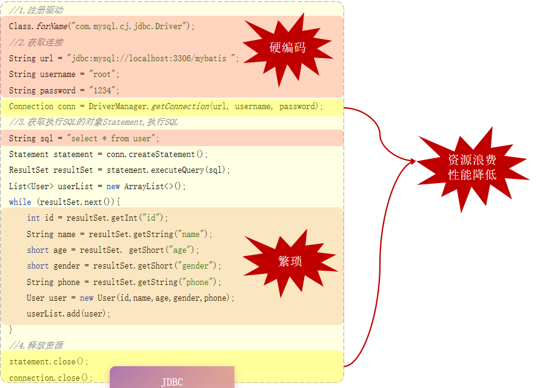

* MyBatis是一款优秀的 持久层 框架，用于简化JDBC的开发
* MyBatis本是 Apache的一个开源项目iBatis,2010年这个项目由apache移到了google code,并且改名为MyBatis。2013年11月迁移到Github。
* 官网: https://mybatis.org/mybatis-3/zh/index.html

## 1. 使用MyBatis
创建 Springboot 项目
勾选 MyBatis framework 和 Mysql connector 依赖
准备数据库和数据库表
```sql
create table user(
    id int unsigned primary key auto_increment comment 'ID',
    name varchar(100) comment '姓名',
    age tinyint unsigned comment '年龄',
    gender tinyint unsigned comment '性别, 1:男, 2:女',
    phone varchar(11) comment '手机号'
) comment '用户表';

insert into user(id, name, age, gender, phone) VALUES (null,'白眉鹰王',55,'1','18800000000');
insert into user(id, name, age, gender, phone) VALUES (null,'金毛狮王',45,'1','18800000001');
insert into user(id, name, age, gender, phone) VALUES (null,'青翼蝠王',38,'1','18800000002');
insert into user(id, name, age, gender, phone) VALUES (null,'紫衫龙王',42,'2','18800000003');
insert into user(id, name, age, gender, phone) VALUES (null,'光明左使',37,'1','18800000004');
insert into user(id, name, age, gender, phone) VALUES (null,'光明右使',48,'1','18800000005');

```
书写数据接收实体
```Java
public class User {
    private Integer id;
    private String name;
    private short age;
    private short gender;
    private String phone;
    // getter setter constructor toString
}
```
配置连接信息
```yaml
# 数据库连接信息 - 四要素
spring.datasource.driver-class-name=com.microsoft.sqlserver.jdbc.SQLServerDriver
spring.datasource.url=jdbc:mysql://localhost:3306/db_mybatis
spring.datasource.username=root
spring.datasource.password=root226
```
编写 Mapper 类, 定义 Select 函数
```Java
@Mapper
public interface UserMapper {
    // 在运行时，会自动生成资接口的实现类对象(代理对象)，并且将该对象交给TOC容器营理
    @Select("select * from user")
    public List<User> listAll();
}
```
编写Test类, 测试 MyBatis 是否正常工作

### 1-1. JDBC介绍
**Java DataBase Connectivity**, 是使用Java语言操作关系型数据库的一套API. 它**只提供一些接口, 也即sun公司官方定义的一套操作所有关系型数据库的规范, 各个数据库厂商(例如MySQL, Oracle, SqlServer)去实现这套接口, 提供数据库驱动jar包**。我们可以使用这套接口（JDBC）编程，真正执行的代码是驱动jar包中的实现类。

JDBC的所有操作均在Java代码中完成, 第一是注册驱动, 例如MySQL, 二是配置连接属性, 包括url/name/password等, 三是连接数据库, 四是单独配置属性和SQL语句并完成数据操作, 最后释放资源. 如图所示, 有三大缺点:

一是数据库连接属性与数据处理相互独立, 然而它们均放在了代码中, 在数据库连接属性改变时, 还需要修改代码, 难以维护.
二是数据处理过程过于繁琐.
三是每次要与数据库交互都需要连接和释放, 影响性能.

在 MyBatis 框架下, 有如下处理:
一是数据库连接的四要素被放在配置文件, 是全局属性, 当数据库更换时只需要更改配置, 同时, 数据库连接(con, cursor)交由**数据库连接池**管理, 可重用, 效率高;
二是定义了**数据实体**, 通过数据实体的各个字段接收查询返回的数据;
三是实现了 Mapper 注解, 在**Mapper接口**中定义函数并与SQL操作进行绑定, 另外Mapper接口遵循**依赖注入**机制, 在IOC容器中会存在一个Mapper接口实现类的对象, 因此在其它地方的Java代码中定义完成后即可使用其中的函数。


### 1-2. 数据库连接池
数据库连接池是个容器, 负责分配、管理数据库连接(Connection), 它允许应用程序**重复使用一个现有的数据库连接，而不是再重新建立一个**, 释放空闲时间超过最大空闲时间的连接(也即线程申请了数据库连接但未在使用), 来避免因为没有释放连接而引起的**数据库连接遗漏**
* 资源重用
* 提升系统响应速度
* 避免数据库连接遗漏

标准接口：DataSource
官方(sun)提供的数据库连接池接口, 第三方组织可以实现此接口以构造适合特性的数据库连接池, 常见的有C3P0, DBCP, Druid, Hikari(Springboot default). 后两个使用居多, 其中Druid连接池是阿里巴巴开源的数据库连接池项目, 功能强大, 性能优秀, 是Java语言最好的数据库连接池之一.
更换连接池只需要更改pom.xml
```xml
<dependency>
    <groupId>com.alibaba</groupId>
    <artifactId>druid-spring-boot-starter</artifactId>
    <version>1.2.8</version>
</dependency>
```
### 1-3. Lombook
在定义数据实体时, 除了自己定义属性字段, 其他的getter, setter, constructor, toString等等都还要自己去写, 虽然可以去生成, 但这些重复性的代码显得臃肿.

`Lombok` 是一个实用的Java类库, 能通过**注解**的形式自动生成 constructor, getter/setter, equals, hashcode, toString 等方法，并可以自动化生成日志变量，简化java开发、提高效率。

引入依赖:
```xml
<dependency>
    <groupId>org.projectlombok</groupId>
    <artifactId>lombok</artifactId>
</dependency>
```

注解| 作用
:-|:-|
@Getter/@Setter	|为所有的属性提供get/set方法
@ToString	|会给类自动生成易阅读的 toString 方法
@EqualsAndHashCode	|根据类所拥有的非静态字段自动重写 equals 方法和 hashCode 方法
@Data	|提供了更综合的生成代码功能（@Getter + @Setter + @ToString + @EqualsAndHashCode）
@NoArgsConstructor	|为实体类生成无参的构造器方法
@AllArgsConstructor	|为实体类生成除了static修饰的字段之外带有各参数的构造器方法。

## 2. mybatis 基础
准备工作:
1. SQL数据
```sql
-- 部门管理
create table dept(
    id int unsigned primary key auto_increment comment '主键ID',
    name varchar(10) not null unique comment '部门名称',
    create_time datetime not null comment '创建时间',
    update_time datetime not null comment '修改时间'
) comment '部门表';

insert into dept (id, name, create_time, update_time) values(1,'学工部',now(),now()),(2,'教研部',now(),now()),(3,'咨询部',now(),now()), (4,'就业部',now(),now()),(5,'人事部',now(),now());


-- 员工管理
create table emp (
  id int unsigned primary key auto_increment comment 'ID',
  username varchar(20) not null unique comment '用户名',
  password varchar(32) default '123456' comment '密码',
  name varchar(10) not null comment '姓名',
  gender tinyint unsigned not null comment '性别, 说明: 1 男, 2 女',
  image varchar(300) comment '图像',
  job tinyint unsigned comment '职位, 说明: 1 班主任,2 讲师, 3 学工主管, 4 教研主管, 5 咨询师',
  entrydate date comment '入职时间',
  dept_id int unsigned comment '部门ID',
  create_time datetime not null comment '创建时间',
  update_time datetime not null comment '修改时间'
) comment '员工表';

INSERT INTO emp
	(id, username, password, name, gender, image, job, entrydate,dept_id, create_time, update_time) VALUES
	(1,'jinyong','123456','金庸',1,'1.jpg',4,'2000-01-01',2,now(),now()),
	(2,'zhangwuji','123456','张无忌',1,'2.jpg',2,'2015-01-01',2,now(),now()),
	(3,'yangxiao','123456','杨逍',1,'3.jpg',2,'2008-05-01',2,now(),now()),
	(4,'weiyixiao','123456','韦一笑',1,'4.jpg',2,'2007-01-01',2,now(),now()),
	(5,'changyuchun','123456','常遇春',1,'5.jpg',2,'2012-12-05',2,now(),now()),
	(6,'xiaozhao','123456','小昭',2,'6.jpg',3,'2013-09-05',1,now(),now()),
	(7,'jixiaofu','123456','纪晓芙',2,'7.jpg',1,'2005-08-01',1,now(),now()),
	(8,'zhouzhiruo','123456','周芷若',2,'8.jpg',1,'2014-11-09',1,now(),now()),
	(9,'dingminjun','123456','丁敏君',2,'9.jpg',1,'2011-03-11',1,now(),now()),
	(10,'zhaomin','123456','赵敏',2,'10.jpg',1,'2013-09-05',1,now(),now()),
	(11,'luzhangke','123456','鹿杖客',1,'11.jpg',5,'2007-02-01',3,now(),now()),
	(12,'hebiweng','123456','鹤笔翁',1,'12.jpg',5,'2008-08-18',3,now(),now()),
	(13,'fangdongbai','123456','方东白',1,'13.jpg',5,'2012-11-01',3,now(),now()),
	(14,'zhangsanfeng','123456','张三丰',1,'14.jpg',2,'2002-08-01',2,now(),now()),
	(15,'yulianzhou','123456','俞莲舟',1,'15.jpg',2,'2011-05-01',2,now(),now()),
	(16,'songyuanqiao','123456','宋远桥',1,'16.jpg',2,'2010-01-01',2,now(),now()),
	(17,'chenyouliang','123456','陈友谅',1,'17.jpg',NULL,'2015-03-21',NULL,now(),now());
```
2. properties配置
```yaml
# 1. 数据库四要素
# ...
# 2. MySQL输出日志信息
mybatis.configuration.log-impl=org.apache.ibatis.logging.stdout.StdOutImpl
# 3. 自动驼峰命名转换
mybatis.configuration.map-underscore-to-camel-case=true
```
3. 数据实体
```Java
package com.rainbow.pojo;
// some import statements here
// ...

@Data
@NoArgsConstructor
@AllArgsConstructor
public class Emp {
    private Integer id;
    private String username;
    private String password;
    private String name;
    private Short gender;
    private String image;
    private Short job;
    private LocalDate entrydate;
    private Integer deptId;
    private LocalDateTime createTime;
    private LocalDateTime updateTime;
}

```
### 2-2. CURD操作
#### 2-2-1. **delete 操作**
    ```Java
    package com.rainbow.Mapper;
    // some import statements here
    // ...

    @Mapper
    public interface EmpMapper {
        // #{id}: 预编译sql, 防止SQL注入
        @Delete("delete from tb_emp where id=#{id}")
        void delete(Integer id);    // 点击删除按钮时依据主键id删除一条记录

        // some other database operation
        // insert, update, select ...
    }
    ```
#### 2-2-2. **预编译sql**
上述删除语句会预编译为`delete from tb_emp where id=?`, 运行时自动填入传入参数值
* 性能更高
  * 执行一条包含多个步骤, 例如SQL语法解析检查, 优化SQL, 编译SQL, 执行SQL; 预编译可以完成前三个步骤并将结果缓存, 使得在执行多条语句时效率更高(例如批量的delete操作)
* 更安全(防止SQL注入)
  * **SQL注入**是通过操作输入的数据来修改事先定义好的SQL语句
  * 例如用户登录页面, 基本逻辑是接收前台返回的account和password然后在数据库查询是否包含该记录并据此决定是否允许登入系统.其SQL语句为: `select count(*) from tb_user where account='user_input_acc' and password='user_input_pwd'`, 通过构造user_input_acc和user_input_pwd可以绕过查询使得查询永远为真:
  * user_input_acc=xxxx
  * user_input_pwd=' or '1'='1
  * 则: `select count(*) from tb_user where account='xxxx' and password='' or '1'='1'`永远为真
* 预编译则不会直接进行字符串拼接, 防止了SQL注入.

#### 2-2-3. **插入语句**
新增一个员工:
```java
package com.rainbow.Mapper;
// 新增一个员工
@Insert("insert into tb_emp(username, password, name, gender, " +
        "image, job, entrydate, dept_id, create_time, update_time) " +
        "VALUES (#{username}, #{password}, #{name}, #{gender}, #{image}, " +
        "#{job}, #{entrydate}, #{deptId}, #{createTime}, #{updateTime})")
void insert(Emp emp);
```
这里利用实体对象作为参数传入, 则`#{}`中的变量会与emp实体字段进行匹配, 需要把命名改为驼峰命名
测试:
```java
@Test
void testInsert(){
    Emp emp = new Emp();
    emp.setUsername("Tom");
    emp.setName("汤姆");
    emp.setGender((short) 1);
    emp.setImage("1.jpg");
    emp.setJob((short) 2);
    emp.setEntrydate(LocalDate.of(2010, 9, 18));
    emp.setDeptId(2);
    emp.setCreateTime(LocalDateTime.now());
    emp.setUpdateTime(LocalDateTime.now());
    empMapper.insert(emp);
}
```

#### 2-2-4. **XML-SQL**
当SQL语句很长很复杂时, 以这样的方式书写CURD操作看起来不舒服, 因此MyBatis使用XML语言将函数和SQL绑定:
```
1. XML映射文件的名称与Mapper接口名称一致，并且将XML映射文件和Mapper接口放置在相同包下（同包同名）。
2. XML映射文件的namespace属性为Mapper接口全限定名一致。
3. XML映射文件中sql语句的id与Mapper 接口中的方法名一致，并保持返回类型一致。
```
官方文档:
    https://mybatis.net.cn/getting-started.html
XML头部实例:
```xml
<?xml version="1.0" encoding="UTF-8" ?>
<!DOCTYPE mapper
  PUBLIC "-//mybatis.org//DTD Mapper 3.0//EN"
  "http://mybatis.org/dtd/mybatis-3-mapper.dtd">
<!-- 以下映射可以自定义 -->
<mapper namespace="org.mybatis.example.BlogMapper">
  <select id="selectBlog" resultType="Blog">
    select * from Blog where id = #{id}
  </select>
</mapper>
```

**将2-2-2的insert语句写入XML并测试:**
```xml
<mapper namespace="com.rainbow.mapper.EmpMapper">
    <insert id="insert">
        insert into tb_emp(username, password, name, gender, image, job, entrydate,
                           dept_id, create_time, update_time)
        VALUES (#{username}, #{password}, #{name}, #{gender}, #{image}, #{job}, #{entrydate},
                #{deptId}, #{createTime}, #{updateTime})
    </insert>
</mapper>
```
原Java代码:
```java
// 新增一个员工
void insert(Emp emp);
```

**MyBatisX**
是一个IDEA插件, 可以为Java代码和对应的MySQL代码两个位置相互关联, 鼠标单击即可跳转, 这样定位代码十分方便。

#### 2-2-5. insert主键回显
考虑新增套餐的场景, 在插入套餐条目后, 还需要维护菜品与套餐的关系表, 因此需要在**插入套餐后返回其ID**;
```java
@Options(useGeneratedKeys = true, keyProperty = "id", keyColumn = "id")
@Insert("insert into tb_emp(username, password, name, gender, image, job, entrydate,"+
                        " dept_id, create_time, update_time)"+
    "VALUES (#{username}, #{password}, #{name}, #{gender}, #{image}, #{job}, #{entrydate},"+
            "#{deptId}, #{createTime}, #{updateTime})")
void insert(Emp emp);
```
正如代码中所示, **在`@Insert`注解前添加一个`@Options`注解**, 指明要返回的字段, 那么该字段可以在插入数据的调用者实体的id显示, 注意Options只和Insert搭配, 如果将Insert的SQL语句转到XML中, 则Options失效, 将不能返回主键值.

### 2-3. 查询语句

**通过 id 查找**
```Java
// EmpMapper
@Select("select id, username, password, name, gender, image, job, " +
            "entrydate, dept_id, create_time, update_time " +
            "from tb_emp where id=#{id}")
Emp getByID(Integer id);
// Test
public void testSelect(){
    System.out.println(empMapper.getByID(10));
}
```
可以看到, 结果查询到了, 并且 deptId, createTime 等字段也不为空, 这就说明 properties 文件的驼峰开启有效(仅在Select注解里).

**条件查询**, 姓名模糊查询/性别/入职时间, 这三个条件都是可选的, 因此使用动态SQL
```xml
<select id="select" resultType="com.rainbow.pojo.Emp">
    select id, username, password, name, gender, image, job, entrydate,
            dept_id, create_time, update_time from tb_emp
    <where>
        <if test="name != null">name like concat('%', #{name}, '%') and </if>
        <if test="gender != null">gender = #{gender} and </if>
        <if test="entrydate != null">entrydate between #{begin} and #{end}</if>
        order by update_time desc
    </where>
</select>
```
有两个需要特别注意的点, 一是`concat('%', #{name}, '%')`, 利用了concat函数将字符串拼接起来, 但同时保留了预编译的特性, 其次注意between和and关键字的使用, 不要使用\<\>等符号(在xml中算特殊字符), 有一个解决方法是:
使用`<![CDATA[]]>`，因为CDATA 部分中的所有内容都会被解析器忽略，所以建议使用`<![CDATA[]]>`, 例如:
`<![CDATA[ and create_time <= #{createTime} ]]>`

## 3. 动态SQL
### 3-1. `<if>`
**场景1**: 在员工查询中, 我们有多个查询条件, 例如姓名、性别、入职时间, 通常会依据其中的零个、一个或者多个条件进行查询, 此时查询SQL语句就不是固定的了

**解决方案: XML中使用`<if>`和`<where>`标签**

**场景2**: 更新员工信息, 仅更新其中的几个关键字, 如果是静态的, 则其他未更新的字段被设置为null值, 这里需要使用`if`和`set`标签
1. 原始的静态SQL语句:
```xml
<update id="update">
    update tb_emp
    set username=#{username}, password=#{password}, name=#{name},
        gender=#{gender}, image=#{image}, job=#{job}, entrydate=#{entrydate},
        dept_id=#{deptId}, update_time=#{updateTime}
    where id=#{id}
</update>
```
假如只想修改部分字段, 那么很自然的就只设置部分字段的值, 例如:
```java
Emp emp = new Emp();
emp.setId(22);      // 更新 22 号数据
emp.setUsername("Amel0");
emp.setName("阿迈尔0");
emp.setGender((short) 2);
emp.setUpdateTime(LocalDateTime.now());
empMapper.update(emp);
```
主要问题在于, 第一是其他字段为null值, 这将会覆盖原有值, 这些"其他字段"可能是具有非空约束的, 这样的插入执行将导致异常
因此, 使用动态SQL语句如下:
```xml
<update id="update">
    update tb_emp
    <set>
        <if test="username !=null">username=#{username},</if>
        <if test="name !=null">name=#{name},</if>
        <if test="gender !=null">gender=#{gender},</if>
        <if test="image !=null">image=#{image},</if>
        <if test="job !=null">job=#{job},</if>
        <if test="entrydate !=null">entrydate=#{entrydate},</if>
        <if test="deptId !=null">dept_id=#{deptId},</if>
        <if test="updateTime !=null">update_time=#{updateTime}</if>
    </set>
    where id=#{id}
</update>
```
**注意: 1. 不要写错字段名; 2.注意表字段和实体字段的命名对应关系; 3.不要忘了写逗号 4. 一定一定不要写错了字段名！！！**


注意拼接时候可能出现SQL语法错误, 需要仔细检查.

