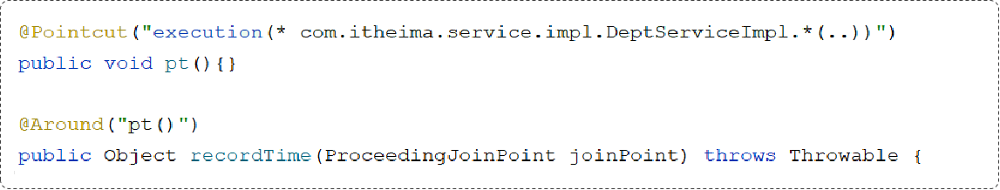
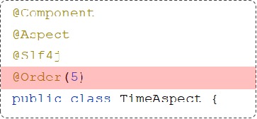
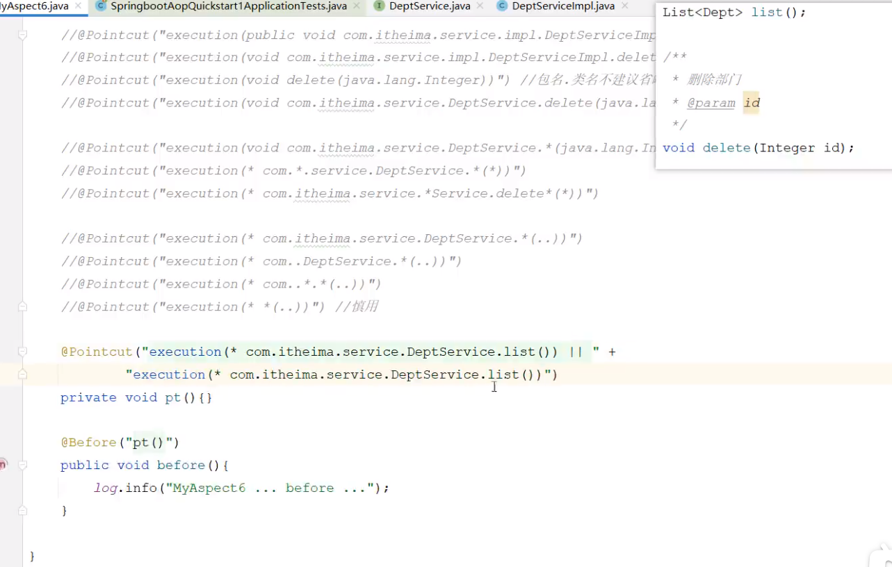
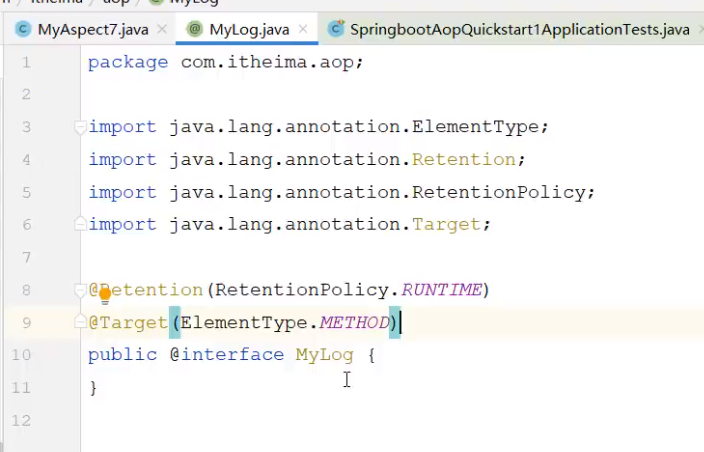
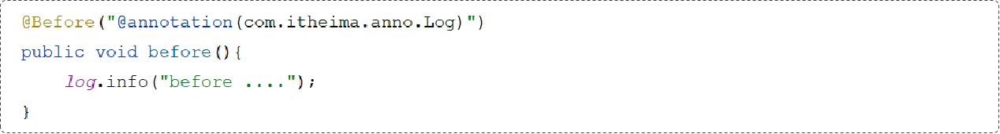
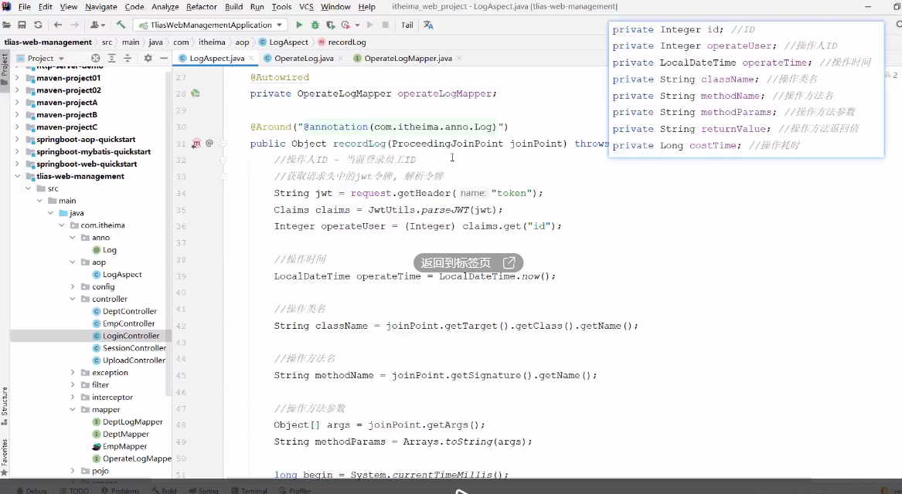

AOP：Aspect Oriented Programming（面向切面编程、面向方面编程），其实就是面向特定方法编程。
场景：
案例部分功能运行较慢，定位执行耗时较长的业务方法，此时需要统计每一个业务方法的执行耗时
实现：
动态代理是面向切面编程最主流的实现。而SpringAOP是Spring框架的高级技术，旨在管理bean对象的过程中，主要通过底层的动态代理机制，对特定的方法进行编程。


Spring AOP快速入门：统计各个业务层方法执行耗时
```xml
<dependency>    <groupId>org.springframework.boot</groupId>    <artifactId>spring-boot-starter-aop</artifactId></dependency>

```
编写AOP程序：针对于特定方法根据业务需要进行编程

```java
@Component
@Aspectpublic class TimeAspect {    @Around("execution(* com.itheima.service.*.*(..))")    public Object recordTime(ProceedingJoinPoint proceedingJoinPoint) throws Throwable {        long begin = System.currentTimeMillis();        Object object = proceedingJoinPoint.proceed(); //调用原始方法运行        long end = System.currentTimeMillis();        log.info(proceedingJoinPoint.getSignature()+"执行耗时: {}ms", end - begin);        return object;
    }

```
AOP核心概念

连接点：JoinPoint，可以被AOP控制的方法（暗含方法执行时的相关信息）
通知：Advice，指哪些重复的逻辑，也就是共性功能（最终体现为一个方法）
切入点：PointCut，匹配连接点的条件，通知仅会在切入点方法执行时被应用
切面：Aspect，描述通知与切入点的对应关系（通知+切入点）
目标对象：Target，通知所应用的对象


AOP执行流程


AOP进阶

通知类型
@Around：环绕通知，此注解标注的通知方法在目标方法前、后都被执行
@Before：前置通知，此注解标注的通知方法在目标方法前被执行
@After ：后置通知，此注解标注的通知方法在目标方法后被执行，无论是否有异常都会执行
@AfterReturning ： 返回后通知，此注解标注的通知方法在目标方法后被执行，有异常不会执行
@AfterThrowing ： 异常后通知，此注解标注的通知方法发生异常后执行
@Around环绕通知需要自己调用 ProceedingJoinPoint.proceed() 来让原始方法执行，其他通知不需要考虑目标方法执行
@Around环绕通知方法的返回值，必须指定为Object，来接收原始方法的返回值。

正常执行完毕哪些通知会被执行? 出现异常时哪些通知会被执行?
```java

```

@PointCut
该注解的作用是将公共的切点表达式抽取出来，需要用到时引用该切点表达式即可。



private：仅能在当前切面类中引用该表达式
public：在其他外部的切面类中也可以引用该表达式

通知类型
@Before（前置通知）
@After（后置通知）
@Around（环绕通知，重点）
@AfterReturning（返回后通知，了解）
@AfterThrowing（异常后通知，了解）

通知顺序
当有多个切面的切入点都匹配到了目标方法，目标方法运行时，多个通知方法都会被执行。
不同切面类中，默认按照切面类的类名字母排序：
目标方法前的通知方法：字母排名靠前的先执行
目标方法后的通知方法：字母排名靠前的后执行
用 @Order(数字) 加在切面类上来控制顺序
目标方法前的通知方法：数字小的先执行


切入点表达式
切入点表达式：描述切入点方法的一种表达式
作用：主要用来决定项目中的哪些方法需要加入通知
常见形式：
execution(……)：根据方法的签名来匹配
@annotation(……) ：根据注解匹配

切入点表达式-execution
execution 主要根据方法的返回值、包名、类名、方法名、方法参数等信息来匹配，语法为：
execution(访问修饰符?  返回值  包名.类名.?方法名(方法参数) throws 异常?)
其中带 ? 的表示可以省略的部分
访问修饰符：可省略（比如: public、protected）
包名.类名： 可省略
throws 异常：可省略（注意是方法上声明抛出的异常，不是实际抛出的异常）


可以使用通配符描述切入点
* ：单个独立的任意符号，可以通配任意返回值、包名、类名、方法名、任意类型的一个参数，也可以通配包、类、方法名的一部分
```execution(* com.*.service.*.update*(*))```
.. ：多个连续的任意符号，可以通配任意层级的包，或任意类型、任意个数的参数
```execution(* com.itheima..DeptService.*(..))```

根据业务需要，可以使用 且（&&）、或（||）、非（!） 来组合比较复杂的切入点表达式。


切入点表达式-execution
书写建议
所有业务方法名在命名时尽量规范，方便切入点表达式快速匹配。如：查询类方法都是 find 开头，更新类方法都是 update开头。
描述切入点方法通常基于接口描述，而不是直接描述实现类，增强拓展性。
在满足业务需要的前提下，尽量缩小切入点的匹配范围。如：包名匹配尽量不使用 ..，使用 * 匹配单个包。


切入点表达式-@annotation
@annotation(com.itheima.anno.Log)




连接点
在Spring中用JoinPoint抽象了连接点，用它可以获得方法执行时的相关信息，如目标类名、方法名、方法参数等。
对于 @Around 通知，获取连接点信息只能使用  ProceedingJoinPoint
对于其他四种通知，获取连接点信息只能使用 JoinPoint ，它是 ProceedingJoinPoint 的父类型
```java
@Before("execution(* com.itheima.service.DeptService.*(..))")public void before(JoinPoint joinPoint) {
String className = joinPoint.getTarget().getClass().getName(); //获取目标类名Signature signature = joinPoint.getSignature(); //获取目标方法签名String methodName = joinPoint.getSignature().getName(); //获取目标方法名Object[] args = joinPoint.getArgs(); //获取目标方法运行参数 
}

```

案例:
将案例中 增、删、改 相关接口的操作日志记录到数据库表中。
日志信息包含：操作人、操作时间、执行方法的全类名、执行方法名、方法运行时参数、返回值、方法执行时长

准备：
在案例工程中引入AOP的起步依赖
导入资料中准备好的数据库表结构，并引入对应的实体类
编码：
自定义注解 @Log
定义切面类，完成记录操作日志的逻辑
获取request对象，从请求头中获取到jwt令牌，解析令牌获取出当前用户的id。


