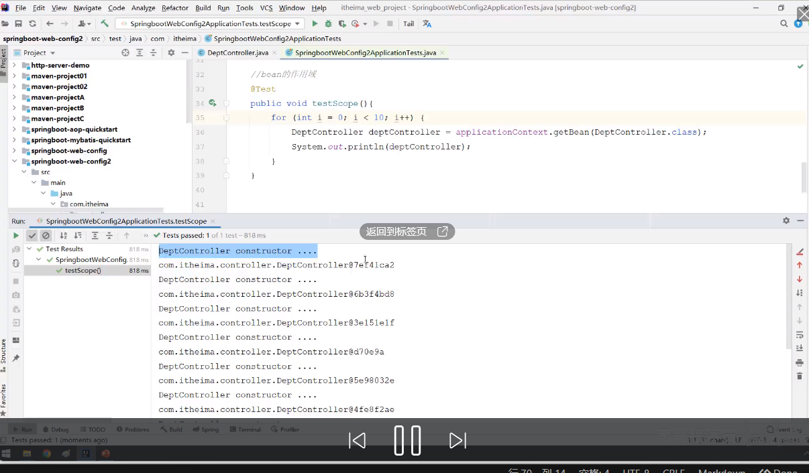
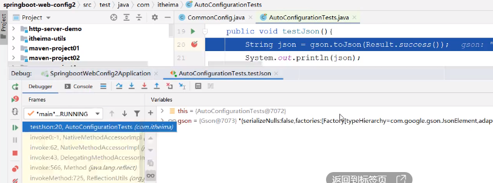
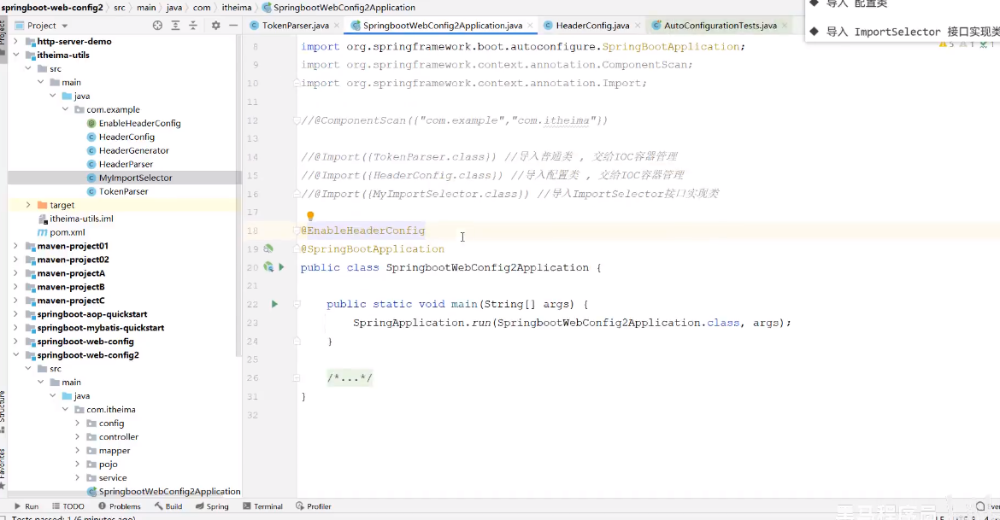
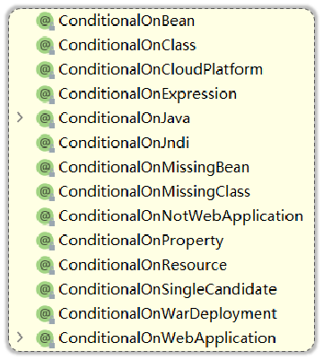
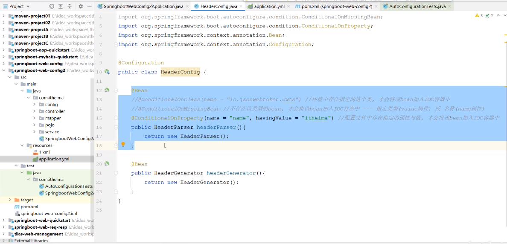
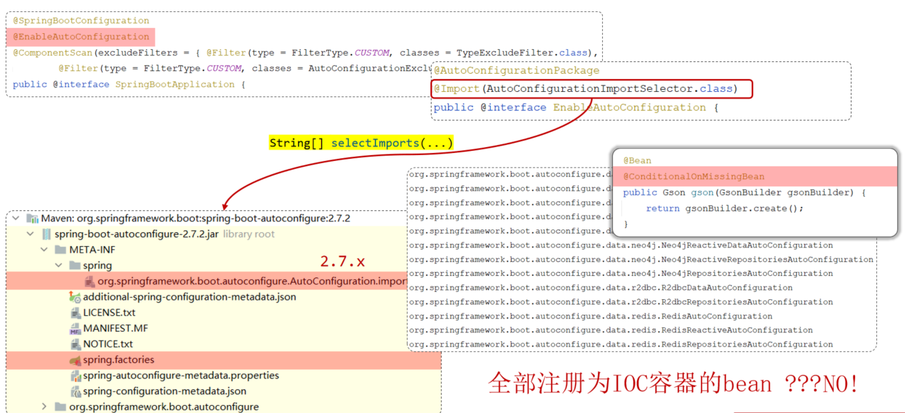

配置
SpringBoot 中支持三种格式的配置文件：
server.port=8081
application.properties

server:
   port: 8082
application.yml

server:
   port: 8083
application.yaml

虽然springboot支持多种格式配置文件，但是在项目开发时，推荐统一使用一种格式的配置 （yml是主流）。

SpringBoot 除了支持配置文件属性配置，还支持Java系统属性和命令行参数的方式进行属性配置。

Java系统属性
Java系统属性是Java虚拟机提供的配置信息，可以通过System.getProperty()方法获取。
-Dserver.port=9000

命令行参数
--server.port=10010
java -Dserver.port=9000 -jar tlias-web-management-0.0.1-SNAPSHOT.jar --server.port=10010

Springboot项目进行打包时，需要引入插件 spring-boot-maven-plugin (基于官网骨架创建项目，会自动添加该插件)

优先级(低→高)
```yml
application.yaml（忽略）
application.yml
application.properties
java系统属性（-Dxxx=xxx）
命令行参数（--xxx=xxx）
```

## bean 管理
### 获取 bean
默认情况下，Spring项目启动时，会把bean都创建好放在IOC容器中，如果想要主动获取这些bean，可以通过如下方式：
根据name获取bean：
根据类型获取bean：
根据name获取bean（带类型转换）：
Object getBean(String name)
<T> T getBean(Class<T> requiredType)
<T> T getBean(String name, Class<T> requiredType)
上述所说的 【Spring项目启动时，会把其中的bean都创建好】还会受到作用域及延迟初始化影响，这里主要针对于 默认的单例非延迟加载的bean而言。

### 作用域
Spring支持五种作用域，后三种在web环境才生效：

作用域	说明
singleton	容器内同 名称 的 bean 只有一个实例（单例）（默认）
prototype	每次使用该 bean 时会创建新的实例（非单例）
request	每个请求范围内会创建新的实例（web环境中，了解）
session	每个会话范围内会创建新的实例（web环境中，了解）
application	每个应用范围内会创建新的实例（web环境中，了解）

lightgallery
显式无参构造, 输出一句话


可以通过 @Scope 注解来进行配置作用域：
@Scope("prototype")@RestController@RequestMapping("/depts")public class DeptController {
}

默认singleton的bean，在容器启动时被创建，可以使用@Lazy注解来延迟初始化（延迟到第一次使用时）。
prototype的bean，每一次使用该bean的时候都会创建一个新的实例。
实际开发当中，绝大部分的Bean是单例的，也就是说绝大部分Bean不需要配置scope属性。

### 第三方 bean
无法给第三方类添加注解
@Component
@Controller
@Service
@Repository
如果要管理的bean对象来自于第三方（不是自定义的），是无法用 @Component 及衍生注解声明bean的，就需要用到 @Bean注解。

若要管理的第三方bean对象，建议对这些bean进行集中分类配置，可以通过 @Configuration 注解声明一个配置类。

config.CommonConfig
@Configurationpublic class CommonConfig {    @Bean    public SAXReader saxReader(){        return new SAXReader();    }}

通过@Bean注解的name或value属性可以声明bean的名称，如果不指定，默认bean的名称就是方法名。
如果第三方bean需要依赖其它bean对象，直接在bean定义方法中设置形参即可，容器会根据类型自动装配。


### SpringBoot: 起步依赖+自动配置
起步依赖：例如 web, 它将基本的 web 开发依赖都自动引入进来, 原理是 maven 的**依赖传递**, 例如包A依赖包B, 包B依赖包C, 则会将 A B C 都引入进来。

自动配置
SpringBoot的自动配置就是当spring容器启动后，一些配置类、bean对象就自动存入到了IOC容器中，不需要我们手动去声明，从而简化了开发，省去了繁琐的配置操作。




方案一：@ComponentScan 组件扫描
@ComponentScan({"com.example","com.itheima"})@SpringBootApplicationpublic class SpringbootWebConfig2Application {
}
"com.alibaba","com.google","org.springframework","org.mybatis",...})
方案二：@Import 导入。使用@Import导入的类会被Spring加载到IOC容器中，导入形式主要有以下几种：
导入 普通类
导入 配置类
导入 ImportSelector 接口实现类
@EnableXxxx注解，封装@Import注
@Import({TokenParser.class, HeaderConfig.class})@SpringBootApplicationpublic class SpringbootWebConfig2Application {
}


 该注解标识在SpringBoot工程引导类上，是SpringBoot中最最最重要的注解。该注解由三个部分组成：
 @SpringBootConfiguration：该注解与 @Configuration 注解作用相同，用来声明当前也是一个配置类。
 @ComponentScan：组件扫描，默认扫描当前引导类所在包及其子包。
 @EnableAutoConfiguration：SpringBoot实现自动化配置的核心注解。

全部注册为IOC容器的bean ???
作用：按照一定的条件进行判断，在满足给定条件后才会注册对应的bean对象到Spring IOC容器中。
 位置：方法、类
 @Conditional 本身是一个父注解，派生出大量的子注解：
 @ConditionalOnClass：判断环境中是否有对应字节码文件，才注册bean到IOC容器。
 @ConditionalOnMissingBean：判断环境中没有对应的bean（类型 或 名称） ，才注册bean到IOC容器。
 @ConditionalOnProperty：判断配置文件中有对应属性和值，才注册bean到IOC容器。







案例: 自定义 starter
需求：自定义aliyun-oss-spring-boot-starter，完成阿里云OSS操作工具类 AliyunOSSUtils 的自动配置。
目标：引入起步依赖引入之后，要想使用阿里云OSS，注入 AliyunOSSUtils直接使用即可。
创建 aliyun-oss-spring-boot-starter 模块
创建 aliyun-oss-spring-boot-autoconfigure 模块，在starter中引入该模块
在 aliyun-oss-spring-boot-autoconfigure 模块中的定义自动配置功能，并定义自动配置文件 META-INF/spring/xxxx.imports


