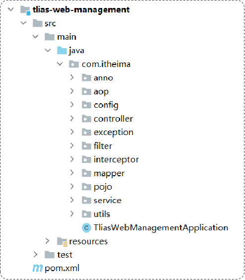
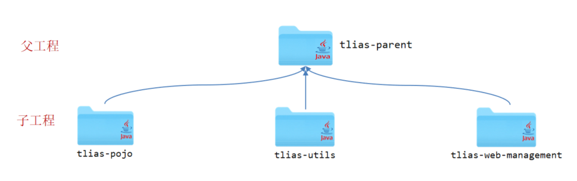
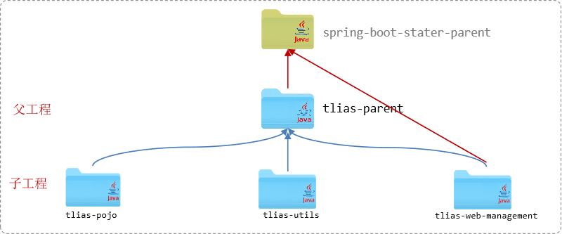

本讲将讲解关于 maven 工具更多的实用功能, 观察现有的 mytlias 系统(mytlias-aop), 它已经包含了众多的特性, 比较臃肿, 是否需要独立出一些模块? maven 可以在各个流程上(编译、运行、发布、安装)对各个模块提供继承、聚合等的管理.

## 1. 原MyTlias结构    

逐个包地进行简要回顾:
> 1. **使用 aop 技术实现操作日志的登记**
anno 中包含一个自定义的注解 Anno, 仅用于标记哪些方法需要被代理, 具体的, 这些方法是增删改相关的操作
aop 切面类, 实现了一个切面类, 它被用作代理, 记录了增删改方法的操作信息, 例如操作时间、操作人、接收参数和返回结果等, 并记录到操作日志表中
> 2. **登录校验(一): 拦截器**
config 包含一个 LoginCheckConfig 类, 它注册需求的拦截器并配置拦截路径, 使需求的拦截器生效
filter/interceptor 分别是过滤器/拦截器, 它们都有拦截请求的效果. 这里我们使用 interceptor -- 拦截器, 它先把位于拦截路径的请求拦截下来, 检查是否包含jwt令牌以及令牌的合法. 只有合法的才会放行, 否则将跳转回登陆界面.
utils 包含关于 JWT 生成和校验的工具类
> 3. **controller: 请求处理层**
它接收请求并调用service层返回处理结果. 例如 LoginController, 它接收登录请求, 校验登录账户的合法性, 对于合法的登录请求, 他还需要借助 JWT工具类 生成一个 jwt-token 并将它封装到响应结果中.
> 4. **service: 服务层**
它实现了服务接口, 一般是依据业务表来设计多个接口, 并设计实现类
> 5. **dao: 数据访问层**
与数据库交互, 完成实际的数据访问操作.
> 6. **pojo: 实体类层**
存放多种实体类.
> 5. **exception: 异常处理层**
集中处理抛出的异常.


## 2. 分模块设计
将项目按照功能拆分成若干个子模块，方便项目的管理维护、扩展，也方便模块间的相互调用，资源共享。
* 什么是分模块设计? 
将项目按照功能拆分成若干个子模块
* 为什么要分模块设计?
方便项目的管理维护、扩展，也方便模块间的相互调用，资源共享
* 注意事项
**分模块设计需要先针对模块功能进行设计，再进行编码。不会先将工程开发完毕，然后进行拆分**

实践, 对于 mytlias:
创建maven模块 tlias-pojo，存放实体类。
创建maven模块 tlias-utils，存放相关工具类。
分模块开发需要先针对模块功能进行设计，再进行编码。不会先将工程开发完毕，然后进行拆分。


## 3. maven 管理
* 继承与聚合
* 继承
* 继承关系
* 版本锁定
* 聚合

### 3.1 maven 项目继承
概念：**继承**描述的是两个工程间的关系，与java中的继承相似，子工程可以继承父工程中的配置信息，常见于依赖关系的继承。
作用：**简化依赖配置、统一管理依赖**
实现：`<parent> … </parent>`


***`jar`***: 普通模块打包，springboot项目基本都是jar包（内嵌tomcat运行）
`war`: 普通web程序打包，需要部署在外部的tomcat服务器中运行
***`pom`***: 父工程或聚合工程，该模块不写代码，仅进行依赖管理

```xml
<parent>
  <groupId>org.springframework.boot</groupId>
  <artifactId>spring-boot-starter-parent</artifactId>
  <version>2.7.5</version>
  <relativePath/>
</parent>
<parent>
  <groupId>com.itheima</groupId>
  <artifactId>tlias-parent</artifactId>
  <version>1.0-SNAPSHOT</version>
  <relativePath>../ tlias-parent/pom.xml</relativePath>
</parent>
```

在子工程中，配置了继承关系之后，坐标中的groupId是可以省略的，因为会自动继承父工程的 。
relativePath指定父工程的pom文件的相对位置（如果不指定，将从本地仓库/远程仓库查找该工程）。
若父子工程都配置了同一个依赖的不同版本，以子工程的为准


### 3.2 版本锁定
在maven中，可以在父工程的pom文件中通过 `<dependencyManagement>` 来统一管理依赖版本。子工程引入依赖时，无需指定 `<version>` 版本号，父工程统一管理。变更依赖版本，只需在父工程中统一变更。

```xml
<dependencyManagement>
  <dependencies>
    <!--JWT令牌-->
    <dependency>
      <groupId>io.jsonwebtoken</groupId>
      <artifactId>jjwt</artifactId>
      <version>0.9.1</version>
    </dependency>
  </dependencies>
</dependencyManagement>
<dependencies>
  <dependency>
    <groupId>io.jsonwebtoken</groupId>
    <artifactId>jjwt</artifactId>
  </dependency>
</dependencies>
```
使用 properties 再集中:
```xml
<properties>
<lombok.version>1.18.24</lombok.version>
<jjwt.version>0.9.0</jjwt.version></properties>
<dependencyManagement>
      <dependencies>
      <!--JWT令牌-->
            <dependency>
                  <groupId>io.jsonwebtoken</groupId>
                  <artifactId>jjwt</artifactId>
                  <version>${jjwt.version}</version>
            </dependency>
      </dependencies>
</dependencyManagement>

<dependencies>
      <dependency>
            <groupId>org.projectlombok</groupId>
            <artifactId>lombok</artifactId>
            <version>${lombok.version}</version>
      </dependency>
</dependencies>
```

* 小结:
`<dependencyManagement>` 与 `<dependencies>`的区别是什么?
`<dependencies>` 是直接依赖, 在父工程配置了依赖, 子工程会直接继承下来.
`<dependencyManagement>` 是统一管理依赖版本, 不会直接引入依赖, 还需要在子工程中引入所需依赖(无需指定版本)

tlias-parent (父工程)(聚合工程)

### 3.3 聚合
将多个模块组织成一个整体，同时进行项目的构建。
**聚合工程**: 一个不具有业务功能的空工程（有且仅有一个pom文件）
作用: 快速构建项目（无需根据依赖关系手动构建，直接在聚合工程上构建即可）

maven中可以通过 `<modules>` 设置当前聚合工程所包含的子模块名称
```xml
<!--聚合-->
<modules>
      <module>../tlias-pojo</module>
      <module>../tlias-utils</module>
      <module>../tlias-web-management</module>
</modules>
```
* 注意事项
聚合工程中所包含的模块，在构建时，会自动根据模块间的依赖关系设置构建顺序，与聚合工程中模块的配置书写位置无关。

#### 继承与聚合
方面| 聚合 | 继承
:-|:-|:-
作用|用于快速构建项目|用于简化依赖配置、统一管理依赖
相同点|pom.xml文件打包方式均为pom，可以将两种关系制作到同一个pom文件中|均属于设计型模块，并无实际的模块内容
不同点|聚合是在聚合工程中配置关系，聚合可以感知到参与聚合的模块有哪些|继承是在子模块中配置关系，父模块无法感知哪些子模块继承了自己

### 3.5 私服
私服是一种特殊的远程仓库，它是架设在局域网内的仓库服务，用来代理位于外部的中央仓库，用于解决团队内部的资源共享与资源同步问题。私服在企业项目开发中，一个项目/公司，只需要一台即可（无需我们自己搭建，会使用即可）。
依赖查找顺序:
```
本地仓库
私服
中央仓库 
```

## 4. MyTlias 重构

1. 创建maven模块 tlias-parent ，该工程为父工程，设置打包方式pom(默认jar)。
2. 在子工程的pom.xml文件中，配置继承关系。
3. 在父工程中配置各个工程共有的依赖（子工程会自动继承父工程的依赖）。




