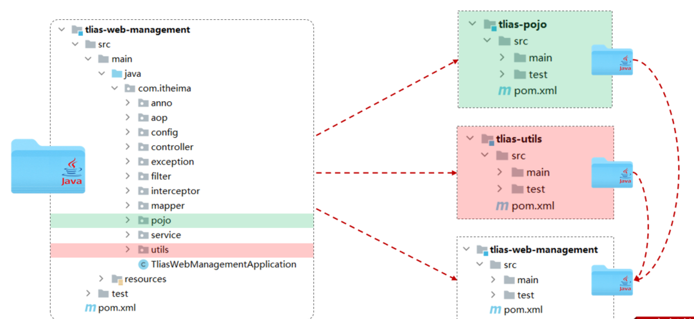
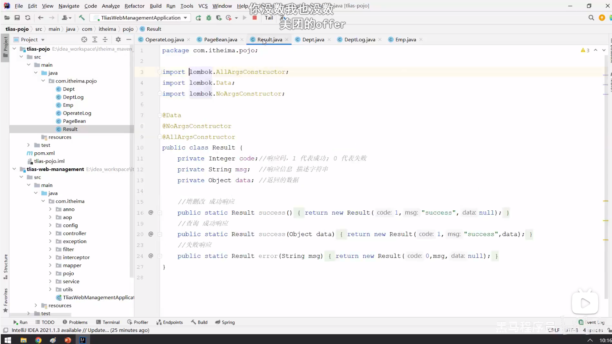

将项目按照功能拆分成若干个子模块，方便项目的管理维护、扩展，也方便模块间的相互调用，资源共享。

创建maven模块 tlias-pojo，存放实体类。
创建maven模块 tlias-utils，存放相关工具类。
分模块开发需要先针对模块功能进行设计，再进行编码。不会先将工程开发完毕，然后进行拆分。




什么是分模块设计? 
将项目按照功能拆分成若干个子模块
为什么要分模块设计?
方便项目的管理维护、扩展，也方便模块间的相互调用，资源共享
注意事项
分模块设计需要先针对模块功能进行设计，再进行编码。不会先将工程开发完毕，然后进行拆分

继承与聚合
继承
继承关系
版本锁定
聚合

概念：继承描述的是两个工程间的关系，与java中的继承相似，子工程可以继承父工程中的配置信息，常见于依赖关系的继承。
作用：简化依赖配置、统一管理依赖
实现：`<parent> … </parent>`


jar：普通模块打包，springboot项目基本都是jar包（内嵌tomcat运行）
war：普通web程序打包，需要部署在外部的tomcat服务器中运行
pom：父工程或聚合工程，该模块不写代码，仅进行依赖管理

①. 创建maven模块 tlias-parent ，该工程为父工程，设置打包方式pom(默认jar)。
②. 在子工程的pom.xml文件中，配置继承关系。
③. 在父工程中配置各个工程共有的依赖（子工程会自动继承父工程的依赖）。


```xml
<parent>    <groupId>org.springframework.boot</groupId>    <artifactId>spring-boot-starter-parent</artifactId>    <version>2.7.5</version>    <relativePath/></parent>


<parent>   <groupId>com.itheima</groupId>   <artifactId>tlias-parent</artifactId>   <version>1.0-SNAPSHOT</version>
   <relativePath>../ tlias-parent/pom.xml</relativePath></parent>

```

在子工程中，配置了继承关系之后，坐标中的groupId是可以省略的，因为会自动继承父工程的 。
relativePath指定父工程的pom文件的相对位置（如果不指定，将从本地仓库/远程仓库查找该工程）。
若父子工程都配置了同一个依赖的不同版本，以子工程的为准


版本锁定
在maven中，可以在父工程的pom文件中通过 `<dependencyManagement>` 来统一管理依赖版本。
子工程引入依赖时，无需指定 `<version>` 版本号，父工程统一管理。变更依赖版本，只需在父工程中统一变更。
```xml
<dependencyManagement>    <dependencies>        <!--JWT令牌-->        <dependency>            <groupId>io.jsonwebtoken</groupId>            <artifactId>jjwt</artifactId>            <version>0.9.1</version>        </dependency>    </dependencies></dependencyManagement>

<dependencies>    <dependency>        <groupId>io.jsonwebtoken</groupId>        <artifactId>jjwt</artifactId>    </dependency></dependencies>


```
使用 properties 再集中:
```xml
<properties>    <lombok.version>1.18.24</lombok.version>    <jjwt.version>0.9.0</jjwt.version></properties>

<dependencyManagement>    <dependencies>        <!--JWT令牌-->        <dependency>            <groupId>io.jsonwebtoken</groupId>            <artifactId>jjwt</artifactId>            <version>${jjwt.version}</version>        </dependency>    </dependencies></dependencyManagement>

<dependencies>    <dependency>        <groupId>org.projectlombok</groupId>        <artifactId>lombok</artifactId>        <version>${lombok.version}</version>    </dependency></dependencies>

```

小结:
```
<dependencyManagement> 与 <dependencies>的区别是什么?
<dependencies> 是直接依赖,在父工程配置了依赖,子工程会直接继承下来。 
<dependencyManagement> 是统一管理依赖版本,不会直接依赖，还需要在子工程中引入所需依赖(无需指定版本)

tlias-parent (父工程)(聚合工程)

聚合
      将多个模块组织成一个整体，同时进行项目的构建。
聚合工程
      一个不具有业务功能的“空”工程（有且仅有一个pom文件）
作用
      快速构建项目（无需根据依赖关系手动构建，直接在聚合工程上构建即可）

```

maven中可以通过 `<modules>` 设置当前聚合工程所包含的子模块名称
```
<!--聚合--><modules>    <module>../tlias-pojo</module>    <module>../tlias-utils</module>    <module>../tlias-web-management</module></modules>

```
注意事项

聚合工程中所包含的模块，在构建时，会自动根据模块间的依赖关系设置构建顺序，与聚合工程中模块的配置书写位置无关。

继承与聚合

作用
聚合用于快速构建项目
继承用于简化依赖配置、统一管理依赖
相同点：
聚合与继承的pom.xml文件打包方式均为pom，可以将两种关系制作到同一个pom文件中
聚合与继承均属于设计型模块，并无实际的模块内容
不同点：
聚合是在聚合工程中配置关系，聚合可以感知到参与聚合的模块有哪些
继承是在子模块中配置关系，父模块无法感知哪些子模块继承了自己

私服是一种特殊的远程仓库，它是架设在局域网内的仓库服务，用来代理位于外部的中央仓库，用于解决团队内部的资源共享与资源同步问题。
私服在企业项目开发中，一个项目/公司，只需要一台即可（无需我们自己搭建，会使用即可）。
依赖查找顺序：
本地仓库
私服
中央仓库 


